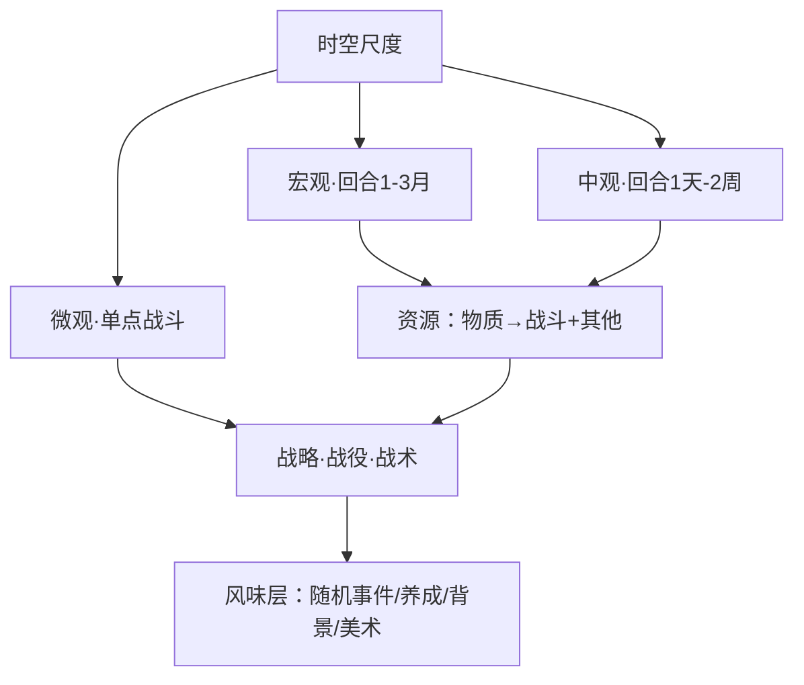

# 《Project Chronos》玩法框架与玩家调研分析

> 上游材料：[腾讯文档《点子收集》](https://docs.qq.com/doc/DUnhCbHJQTXBCSWtM)（作者：森）—— 策划框架 + 8 个设计问题 × 8 位受访玩家（含作者共 9 段回答）。
> 本文产出：**① 玩法框架（逐项标注确定/未决/参照）② 调研根因归类 ③ 决策矩阵**。全部细节与原文证据保留于正文，供后续 GDD 撰写直接引用。

## 标注体系（阅读约定）

| 标记 | 含义 |
| :--- | :--- |
| ✅ **确定** | 上游文档内有明确结论，或森本人明确表态的方向 |
| ⚠️ **未决** | 存在分歧、尚无结论，或需市场/原型验证 |
| 📎 **参照** | 仅作为参照系出现的游戏/机制，不代表已选型 |

**受访者代号**：森（作者）/ 唐史（唐朝史研究生）/ 学生（大二，AI 辅助做桌游）/ 杭（杭州，轻度桌游玩家）/ 石（石家庄，桌游高手·多人向）/ 北大（北大留美打工人）/ 晋（山西）/ 赣（江西，信息奥赛教培）/ 秦（秦皇岛，财务）。

---

## 一、玩法框架（核心交付 1）

### 1.1 总览



### 1.2 时空三尺度（✅ 框架成立；主舞台取舍 ⚠️）

| 尺度 | 回合粒度 | 玩家操作对象 | 参照游戏 | 状态 |
| :--- | :--- | :--- | :--- | :--- |
| **宏观** | 每回合 1–3 个月 | 管理经济/资源/组织/作战单位；大方向操作，较少微操（"撞一下兵就打完"） | 📎 战火中的世界（二战桌游，法国横向 6 格）、Unconditional Surrender!（法国横向 12 格）、全战帝国/拿破仑（法国仅 1–2 个主城） | ✅ 定义清晰 |
| **中观** | 每回合 1 天–2 周 | 资源管理任务下降，偏向时空移动 | 📎 英雄无敌 3（1 天/回合）、三国志 9（1 周/命令） | ✅ 定义清晰 |
| **微观** | 单点战斗 | 在上述地图某一点展开战斗，常见关卡式、侧重临场战术 | 📎 英杰传系列（英杰传/孔明传/曹操传）、统一指挥 2（Unity of Command 2，二战过关 SLG，"有一万个 DLC"，国内制作者用该系统做解放战争题材）、超级机器人大战系列、圣女战旗、终极将军：内战、指挥大师（Master of Command） | ✅ 定义清晰 |

> ⚠️ **未决**：本作以哪一档为主舞台？——关联决策矩阵 D6。

### 1.3 资源体系（✅ 三分法成立；数值 ⚠️）

```
物质资源（钱/能源/魔法等货币）
   ├── 兑换 ──→ 战斗资源（单独设计兑换比例）
   └── 转化 ──→ 其他资源（用钱爬科技、用钱买牌）
```

| 资源类型 | 内容明细 | 参照游戏 |
| :--- | :--- | :--- |
| **物质资源** | "钱"、能源、魔法等货币，可转化为战斗资源；需单独设计兑换比例 | 📎 钢铁雄心 4（用枪买兵）、欧陆 4（钱+人力买兵）、strategic command 系列（一种钱买所有东西）、战火中的世界 |
| **战斗资源** | ① 战斗单位：根据敲定的玩法模式关联合适游戏背景，以此设计单位、人物<br>② 特殊角色：属性、物品、道具、技能、人物槽位、人物间关系（从属关系、羁绊等）<br>③ 战斗获得的资源：缴获（钢铁雄心）/ 劫掠（全面战争）/ 俘虏（统一指挥）/ 额外奖励（机战系列） | 📎 见右侧各例 |
| **其他资源** | 天气、环境、科技、卡牌、特性、外交政治状态等；可由物质资源转化，也可单独作为游戏核心资源（如卡牌） | 📎 桌游：光荣之路、教改风云、汉尼拔：罗马 VS 迦太基 |

> ⚠️ **未决**：资源组合方案与兑换比例数值（需原型沙盘验证，可复用 `03_prototypes_and_tools` 工作台）。

### 1.4 玩法三层（✅ 框架成立）

| 层 | 行为定义 | 承载内容 | 状态 |
| :--- | :--- | :--- | :--- |
| **战略** | 资源管理 | ① 货币直接转化的战斗资源 ② 养成型资源：科技/理念/技能/特性/角色属性 ③ 独立的抽象资源：卡牌/道具 | ✅ |
| **战役** | 时空上的移动 | P 社游戏、全面战争、三国志 9、英雄无敌系列走地图撞兵；过关类 SLG 的关卡模式 | ✅ |
| **战术** | 如何结算战斗 | 见 1.5；战后影响见 1.6 | ✅（方式 ⚠️） |

### 1.5 战术结算——定输赢（⚠️ 核心分歧区）

**式 ①：以"整坨兵"的属性为锚点，在地图上统一移动、统一结算**（✅ 作为通用底座）
- 影响因素：战斗力、地形、特性、道具、天气、随机数、卡牌
- 最简单形态：整坨兵 = 单一数值（X 点攻击、Y 点血量，整体发挥作用）
  - 📎 教改风云（稚嫩的魔法师制作的桌游）：一坨兵提供 X 个骰子，一次掷 Y 个，按规则和道具结算得 Z 点伤害
- 可拆分形态：P 社式——30 个兵 20 个参战，10 前排 10 后排，不同兵互打
  - 📎 CK2、EU4/5、V2/3 均采用类似机制
- 适用：战略/战役地图（一般地图类游戏的"大地图"）

**式 ②：大地图上单位直接行动**（✅ 存在共识，作为补充）
- 📎 easytech 欧陆战争系列、strategic command 系列（电子桌游）、P 社钢 2 手操空军、EU4 的 50 点炸城墙

**式 ③：小地图战术战斗**（⚠️ 是否引入未决）
- 四节流程：地图/关卡（可特化：攻城、水战）→ 布阵 → 行动 → 结算
- 特殊战斗模式：互相打牌（📎 汉尼拔：罗马 VS 迦太基）
- 📎 参照系：field of glory 系列（大地图撞兵，回合制交战）、great battles of history 系列（桌游，森手头有一盒）、汉尼拔（特色打牌战斗）、线列战争（EU4 后期排队枪毙）、终极将军：内战 / 指挥大师（含养成）、valor & victory / second front（一战二战电子桌游）、欧根（出处：晋 Q3——"欧根那种战役走格子，战斗没格子的"，某战役层走格子、战斗层无格子的作品）

### 1.6 战后影响（✅ 确定）

1. 战斗/关卡奖励
2. 对大地图的影响（战斗输赢影响地图区域政治控制权）
   - 📎 信长之野望最新作"大威风"、汉尼拔：罗马 VS 迦太基

### 1.7 风味层：可触发内容（✅ 作为设计支柱）

随机事件、养成路线、背景故事、相应的美术表现。
> ⚠️ 反面教材：SGS taiping（太平天国题材）——做了风味但没做好。

### 1.8 框架状态汇总

**已确定（✅）**
1. 时空三尺度作为分析轴（1.2）
2. 资源三分法：物质 → 战斗 + 其他（1.3）
3. 玩法三层：战略/战役/战术（1.4）
4. 战术底座 = 整坨兵统一结算（可拆分）+ 大地图单位直接行动（1.5 式①②）
5. 战后影响双通道：奖励 + 大地图政治控制权（1.6）
6. 风味层存在且需要做好，否则是负资产（1.7）
7. 城地表达：一城占一块地，城上/周边建筑影响作战地形（决策矩阵 D5）

**未决（⚠️）**
- 主舞台尺度：宏观独走 or 多尺度贯通（D6）
- 是否引入小地图战术战斗 / 双轨（D4）
- 资源兑换比例数值（D2）
- 回合节奏分代数值（有秦的基准提案，D6）
- 题材国别/冷热（D1，需市场验证）

**参照系（📎）**：见各节标注，全部保留不删。

### 1.9 参照游戏总表（上游"有借鉴参考价值的游戏"全量保留）

> 上游文档第五节逐项收录，作为选型的横向参照库（含电子 + 桌游）。

| 参照维度 | 作品清单 |
| :--- | :--- |
| 通过"货币"转化资源 | 各类大战略游戏；strategic command 系列（电子桌游，**一种钱买所有东西**） |
| 养成型资源 | 英杰传系列、超级机器人大战系列、终极将军：内战、指挥大师 |
| 卡牌/道具等抽象资源 | 桌游：光荣之路、教改风云、汉尼拔：罗马 VS 迦太基 |
| 桌游改电子游戏 | victory & glory napoleon / civil war（拿破仑与美国内战题材） |
| 时空上的移动 | P 社游戏、全面战争、三国志 9、英雄无敌系列 |
| 整坨兵撞兵 | P 社游戏、全面战争（使用自动结算）、教改风云 |
| 大地图上单位直接行动 | easytech 欧陆战争系列、strategic command 系列、P 社 |
| 小地图战术战斗·古代—中世纪 | field of glory 系列（大地图撞兵，回合制交战）；great battles of history 系列（桌游，森玩过一些且手头有一盒）；汉尼拔（特色战斗）；线列战争（EU4 后期排队枪毙）；终极将军：内战、指挥大师（含养成） |
| 小地图战术战斗·20 世纪前期（一战二战） | valor & victory、second front（电子桌游） |
| 战后影响 | 信长之野望最新作"大威风"、汉尼拔：罗马 VS 迦太基（战斗输赢影响地图区域政治控制权） |
| 风味反面教材 | SGS taiping（太平天国题材）——做了风味但没做好 |
| 相关视频 | B 站 [BV1dYFXecEuu](https://www.bilibili.com/video/BV1dYFXecEuu)（聊"这类桌游"的视频） |

---

## 二、调研根因归类（核心交付 2）

> 方法：不按受访者罗列，而是把回答背后的**驱动原因**归纳为主题。每个根因给出：根因句 → 支持者分布 → 原文证据 → 设计含义。

### R1 考据即沉浸：出戏 = 系统级失败

- **根因句**：玩家的"历史沉浸"依赖系统层面的可信感（数据细致、机制可推演），表层考据错误会瞬间击穿沉浸；历史要素宜"捕风捉影"式点到为止，忌过度设计喧宾夺主。
- **支持者**：唐史、赣、学生（大二）
- **原文证据**
  - 唐史：*"国外，因为国内的考证总出戏"*
  - 赣：*"历史感带来的沉浸"*（评文明/全战"沉浸不如欧陆"）
  - 学生：*"欧陆风云这类游戏通过足够细致的数据和可操作性给玩家提供了一种假装自己能模拟历史的错觉"*；*"假装这个游戏很严谨，历史的各个要素能够捕风捉影出来，但是较少过度设计喧宾夺主"*
- **设计含义**：机制先行、考据支撑；"错觉式严谨"（plausible simulation）比"百科全书式堆料"更值得做。

### R2 将领价值随时代衰减（"汉尼拔 vs 骰子+1"分界论）

- **根因句**：将领特化的接受度与"个体影响力是否匹配历史直觉"正相关——越古代个体英雄越可信，越现代越出戏；RPG 化是光谱而非开关。
- **支持者**：森（提出分界线）、唐史（支持但克制）、杭（支持但忌过头）、学生（条件式）、石（反对）、赣（反对）、北大（支持，为 MOD）、晋（支持，为营销）、秦（支持，要求质数量平衡）
  - 分布：**倾向"特殊但克制" 7/9，明确反对 2/9**（石、赣）
- **原文证据**
  - 森：*"2000 年前的汉尼拔逆天改命，2000 年后的德军名将骰子+1，显然前者更有意思"*；*"以拿破仑战争左右为分界线，以前将领更有用，往后将领更没用"*
  - 唐史：*"欧陆的将领已经很强大了，应该让强大将领更珍惜一些"*
  - 杭：*"将领还是需要有一些自身特色，但是全战三国那种属于过头了"*
  - 学生：*"如果这个游戏主打沉浸，希望；主打推演（严肃），不希望"*
  - 晋：*"将领肯定得特殊点，有将领很适合忽悠轻度玩家来买"*
  - 秦：*"希望，但希望质量和数量能做出平衡"*
  - 北大：*"pc 的话希望将领特殊 方便做 mod"*
  - 石：*"不希望"*
  - 赣：*"大部分时候不希望，太 rpg 了"*
- **设计含义**：✅ 方向确定——将领特殊化 + 时代调节权重 + 稀缺感（"珍惜"）。RPG 度上限参考"杭"的判据（别学全战三国）。

### R3 地图抽象 = 通行容量与制作成本的权衡

- **根因句**：格子本质是"地区在单位时间内可通行和进入的容量"的可视化；六角格在距离上最诚实；无格/区域划分对制作者的信息成本最高，收益仅在特定玩法成立。
- **支持者**：森（六角格）、秦（容量论）、唐史（方格更省事）、晋（菱形或隐藏菱形，视地图层级）、石（分级>区域/点对点）、赣（历史模拟无格，类文明菱形）、学生（有格子+会战机制）、北大（不本质）、杭（未直接作答，只表达了"大战略地图"偏好）
- **原文证据**
  - 森：*"如果要拿比较拟合现实时空的话，用六角格（文明）是比较好的，真正意义上的距离均等。如果主动划分，查找地图资料并结合游戏需要进行划分其实是非常困难的工作"*；并注明出处为 *"我记得看过一个文章"*
  - 秦：*"方格和六角格本质代表一个地区在游戏单位时间内可以通行和进入的容量，如果有规划甚至可以点对点自由花线"*（原文作"花线"，疑为"划线"笔误）
  - 唐史：*"方格更方便，地区划分对划分者要求过高"*
  - 晋：*"菱形或者隐藏菱形吧，我觉得得取决于是大地图还是战斗地图。欧根那种战役走格子，战斗没格子的可以考虑下"*
  - 学生：*"更喜欢有格子加会战的机制（一战以后除外，更喜欢格子加战线机制）"*
  - 石：*"分级最好，区域/点对点次之"*
  - 赣：*"历史模拟倾向没有方格，类文明的游戏菱形"*
- **设计含义**：✅ 倾向六角格为主（森明确 + 秦的容量论补强）；战斗层是否无格留口子（欧根式）；点对点自由划线可作为远期扩展（秦）。

### R4 战斗形态由"游戏内时间跨度 × 战斗频率"决定

- **根因句**：结算频率 × 单次结算成本必须与时间跨度匹配——长期高频战斗必须低结算成本（撞兵/自动），短期低频可承担高成本（下棋/场景战斗）；"会战"提供仪式感价值。
- **支持者**：森（20 年判据）、唐史（下棋疲劳）、晋（会战仪式感 + 小/大会战分层）、杭（Axis & Allies 式大战略图 + RTS 小地图）、秦（大图+加载场景即时战斗，推荐终极将军内战）、石（棋最好）、学生（会战偏好 CA 感）、赣（皆可，但要求公式透明）、北大（除"文明式弱智加力战斗"和"V3 无战斗"外皆可）
- **原文证据**
  - 森：*"如果游戏的时间跨度很长（20 年以上），而且战斗很频繁用撞兵战斗比较好。较短用下棋好一点。设计自动战斗的功能"*
  - 唐史：*"战斗场景下棋在后期可能会累死人"*
  - 晋：*"我感觉有个会战系统比较有仪式感……可以试试区分小规模战斗和决定性会战"*
  - 杭：*"我心目中比较好玩的大战略类是 2004 年的《轴心国与同盟国》，大战略地图+RTS 小地图，比全战的纯带兵牌多了各种建筑建造"*
  - 秦：*"有大地图和加载场景的即时战斗，推荐一个机制是终极将军内战"*
  - 学生：*"会战更喜欢类似 CA 这类感觉"*
  - 赣：*"皆可。但我希望能详细了解到作战计算机制。不管是欧陆还是文明经常掩去具体计算公式，让我不爽"*
- **设计含义**：⚠️ 核心未决。森的 20 年判据 + 自动战斗兜底是调和器；两条"大图+场景"路线参照：杭 → Axis & Allies（大战略图 + RTS 小地图 + 建筑建造），秦 → 终极将军内战（大图 + 加载场景即时战斗）。

### R5 城 = 地（特殊格子），不是点

- **根因句**：点式城市切断地理连续感；格子式让城市参与地形与作战表达，且城市尺寸可随题材放大。
- **支持者**：森、唐史、杭、石、学生、晋（6/9 明确支持"一城占一块地"式表达）；秦（投"三国志系列"式，即城市+辖地区块）；北大、赣（不本质）
- **原文证据**
  - 森：*"一个城占一块地，城上面/周边的建筑影响作战时的地形"*
  - 唐史：*"占地下棋"*
  - 杭：*"2026 年了还是分点区块吧"*
  - 石：*"简单区分城地即可"*
  - 学生：*"更喜欢将城市理解成特殊的格子而不是一个点"*
  - 晋：*"其实可以考虑把城市设计成更大一圈的六边形，尤其是涉及复杂地形"*
  - 秦：*"三国志系列吧"*（即问题 5 的 B 选项：城市+辖地区块体系，区别于"一城一格"）
- **设计含义**：✅ 确定——城=特殊格子（可为多格/大六边形），建筑影响周边地形。

### R6 回合节奏是"操作框架"的下游，随时代分代

- **根因句**：回合粒度不是独立参数，而是"玩家每回合要做什么"（操作框架）的下游；时代决定可想象的时间粒度；支持自动执行以减少点按疲劳。
- **支持者**：森（自己走时间）、唐史（自动执行 1–3 月）、杭（一顿计算下月）、石（跟操作框架走）、秦（时代分代数值）、赣（回合越大越桌游）、学生（三国志 9/14 式 + 会战机制）、晋（取决于游戏时长和时段）、北大（取决于前面，不本质）
- **原文证据**
  - 秦：*"火枪时期往前应该在 3 个月，往后应该在 1 个月甚至更短（战略级）；至于战术级别，那不应该超过一周"*
  - 赣：*"回合越大越桌游，回合越小越即时"*
  - 石：*"时间尺度跟着操作框架走"*
  - 杭：*"一顿计算直接到下一个月就可以了"*
  - 森：*"自己走时间"*
  - 晋：*"回合得考虑游戏时长吧和时段吧"*
  - 北大：*"显然取决于前面几个问题的答案 但是也不本质"*
- **设计含义**：✅ 方向确定（时代分代 + 自动执行）；数值用秦的提案作基准——**古战 3 个月 / 火枪后 ≤1 个月 / 战术级 ≤1 周**（待原型验证）。

### R7 竞品空白 = 生态与自由度问题，不是品类饱和

- **根因句**：P 社的护城河是 MOD 生态 + 地块自由度，而非"历史模拟"本身；全战/文明各自短板（内政外交简陋、时空观出戏）给了 P 社空间；部分受访者不认可"P 社不可替代"的前提。
- **支持者**：杭（MOD 生态）、晋（全战懒+精力错配）、秦（自由度）、唐史（市场容量）、赣（沉浸不足论——文明/全战"沉浸不如欧陆"）、北大与石（不认可前提）、森（桌游实体操作量 / 手机氪金 / 简化 vs 伪复杂）
- **原文证据**
  - 杭：*"P 社游戏优点就是 MOD 多，P 社做不到的玩家替它做，这个懒逼公司"*
  - 晋：*"全战替不了是因为懒狗，加上一大段精力分在战斗这个具体表现上了，P 社的实际战斗和平衡一般不太存在——某种角度来说，可能胡逼一点有利于宣传"*
  - 秦：*"因为很简单，地块多少决定自由度。自由度决定玩家发挥程度，和游戏上限程度"*
  - 森（竞品盘点）：桌游 EU4 *"即使计算对于玩家来说很简单，实体操作量也太大"*；手机欧陆战争 *"战斗比较粗糙，运营比较氪金化"*；文明时代系列 *"作为战略游戏战斗和加减法几乎没区别，过于简单"*；超级力量 *"看上去做了很多，其实有用的东西不多，优点像 eu5 的毛病"*；文明时空观 *"不管小地图还是超大地图，步兵骑兵走一次都是两格/四格"*、*"越古越强，很多文明几乎是没什么特殊性的白板"*；全战 *"战斗足够出色，经济、内政、外交等方面虽然有但是相当简陋"*（附庸莫名宣战）
- **设计含义**：把"自由度 = 地块数 × 可操作深度"当硬指标；预留 MOD 生态位；避坑清单 = 避免"看着多做用少"（超级力量/EU5 病）、避免时空观出戏（文明式）、避免内政外交太简陋（全战式）。

### R8 吸引力本质 = 控制力 + 沉浸 + 系统可信，三者在场

- **根因句**：表层吸引力是涂色与历史皮肤；深层是"在一个可信系统里施加影响并看到结果"——控制力/自由度、系统可信（AI 平衡）、历史沉浸三者共振；桌游圈额外看重"预设规则下的多人互动"。
- **支持者**：晋（控制力）、秦（自由度）、森（掌控感+系统+性价比）、学生（模拟错觉）、唐史（蝴蝶效应）、赣（历史感）、石与北大（多人互动）
- **原文证据**
  - 晋：*"最大吸引力，其实是控制力"*
  - 秦：*"并不是（历史真实性）……简单来说就是自由度。更大更复杂的地图。更好的地块自由发展"*
  - 森：*"有一套在游戏设定世界观内相对稳定、普遍、可运行的系统。在此基础上，玩家通过选择不同势力/角色可以体验的风味故事内容比较丰富，且有历史沉浸感、差异感，甚至能产生玩梗的快乐。掌握游戏系统后，玩家有一定的掌控感和获得感。游戏周期较长，游戏实际性价比较高。在一个相对复杂的游戏环境下，游戏 AI 表现虽然有槽点，但比同类游戏相对较好"*
  - 唐史：*"人和 AI 相对平衡，可以在游戏内看到玩家对局面扰动的蝴蝶效应"*
  - 石/北大：*"预设历史背景和规则下的多人互动"*
- **设计含义**：✅ 三大支柱直接进 GDD——**稳定可运行的系统 / 风味与沉浸（含玩梗价值）/ 控制力与自由度**；AI 平衡（唐史）与性价比（森）作为隐性支柱。

---

## 三、决策矩阵（核心交付 3）

> 读法：一题一行。票型列 = 谁投了什么（代号见文首）；建议列 = 综合森的表态 + 多数票 + 我（分析）的判断，供下一步讨论。

| # | 决策项 | 票型分布 | 关键论据 | 状态 | 建议 |
| :-- | :--- | :--- | :--- | :--- | :--- |
| **D1** | 题材：国别 / 冷热 | 国外：唐史、赣；国内：石；冷兵器优先（国别未明）：晋；视情况/均可：森、学生、杭、北大、秦 | 森：深度玩家更吃国内+梗文化，市场证据——轻量玩家喜欢全战三国、重度玩家喜欢 CK3"普天之下"DLC；唐史/晋：国内考证出戏 / 热兵器国内题材"有点微妙危险" | ⚠️ 需市场验证 | **国内题材 + 梗文化位**为主探索方向（森的产品判断优先），考据外包给专业审核以治"出戏"；冷兵器优先（晋的"危险"提示 + 石要热兵器的 1/9） |
| **D2** | 将领系统 | 支持特化 7：森、唐史、杭、学生、北大、晋、秦；反对 2：石、赣 | 森：拿破仑战争分界，以前将领有用往后没用；杭：特色可以但别全战三国式过头 | ✅ 方向确定 | **将领特殊化，时代调节权重 + 稀缺化**（唐史"更珍惜"）；RPG 上限参照杭的判据；推演模式可提供"将领淡化"开关（学生） |
| **D3** | 地图系统 | 六角格/方格系：森（六角）、唐史（方格）、学生（格子+会战）、秦（容量论）、晋（菱形或隐藏菱形）；无格：赣（历史模拟）；分级：石；不本质/未答：北大、杭 | 森：六角距离均等最拟合现实（出处"看过一个文章"）；唐史：划分成本高；秦：格子=通行容量，可点对点划线；晋：大地图/战斗地图可分层 | ✅ 倾向确定 | **六角格为主**（主舞台）；战斗层预留无格/欧根式空间（晋 Q3）；点对点自由划线作远期扩展（秦） |
| **D4** | 战斗形态 | 撞兵/低结算成本：森、唐史、石；大图+场景/小地图：杭（Axis & Allies 式 RTS 小图）、秦（终极将军内战式）、晋（会战仪式感+大小会战分层）、学生（会战 CA 感）；皆可/不限定：赣（要求公式透明）、北大（除文明式加力战斗、V3 无战斗外皆可）；三国志 9 式大地图即时混战：无人直接选（选项保留） | 森：20 年+高频→撞兵，短→下棋，做自动战斗；秦：推荐终极将军内战机制；杭：Axis & Allies 大战略图+RTS 小图+建筑建造 | ⚠️ 核心未决 | **双轨**：撞兵/自动结算作默认底座（长期高频），标志性会战进"加载场景"（明确玩法设计，参照终极将军内战 / Axis & Allies），默认自动战斗兜底；数值门槛用森的 20 年判据 |
| **D5** | 城地表达 | 一城占一块地（A）：森、唐史、杭、石、学生、晋（6/9）；三国志式城+辖地区块（B）：秦；不本质：北大、赣 | 森：一城占一块地，建筑影响作战地形；学生：城市=特殊格子；晋：可做大一圈六边形；秦：投"三国志系列"式 | ✅ 确定 | **城 = 特殊格子（可为 2–7 格的大六边形）**，城及周边建筑进入作战地形计算；保留秦的"三国志式（城+辖地区块）"作为中尺度备选；现代题材可放大城市体量（晋） |
| **D6** | 回合节奏 | 自动执行：森、唐史、杭；时代分代：秦、晋、石、学生、赣；取决于前面/不本质：北大 | 秦：火枪前 3 个月 / 火枪后 ≤1 个月 / 战术 ≤1 周；赣：回合越大越桌游越小越即时；石：时间尺度跟操作框架走 | ✅ 方向确定 | **分代节奏 + 自动执行**：基准值采用秦的提案，用原型沙盘微调；战术层单独时钟（≤1 周） |
| **D7** | 竞品定位 | 生态论：杭、晋；自由度论：秦；市场容量：唐史；不认可前提：石、北大 | 杭：P 社靠 MOD 生态（懒逼公司）；秦：地块数=自由度；森：EU4 桌游实体操作量劝退 | ✅ 避坑清单 | **自由度=地块数×可操作深度**作硬指标；预留 MOD 生态位；避坑：伪复杂（超级力量/EU5）、时空出戏（文明）、内政外交简陋（全战） |
| **D8** | 吸引力支柱 | 控制力：晋、秦；沉浸：赣、唐史(蝴蝶效应)；系统可信：森、学生；多人互动：石、北大 | 森：稳定系统+风味+掌控感+性价比；晋：控制力；秦：自由度 | ✅ 确定 | **三大支柱入 GDD**：稳定可运行系统 / 风味沉浸（含玩梗）/ 控制力自由度；AI 平衡 + 性价比为隐性支柱 |

### 矩阵结论（一屏速读）

- **已确定 5 项**：将领特化（D2）· 六角格（D3）· 城=特殊格子（D5）· 分代回合+自动执行（D6）· 三大吸引力支柱（D8）
- **待验证 2 项**：题材国别（D1）· 战斗双轨（D4）
- **避坑清单 1 项**（D7）：伪复杂 / 时空出戏 / 内政外交简陋 / 无 MOD 生态位

---

## 四、开放问题（下次会议/原型验证用）

1. **题材市场验证**：国内+梗 vs 国外考据——需要更多二手市场数据（销量、MOD 下载量、社区二创热度）
2. **主舞台尺度**：宏观独走，还是三尺度贯通（宏观调度 → 中观行军 → 微观会战）？建议先用"贯通"出原型再砍
3. **战斗双轨工程量**：撞兵底座（低）+ 标志性会战场景（高）——评估工作量与 MVP 取舍
4. **兑换比例数值**：资源三分法的兑换曲线需进沙盘验证（复用 `03_prototypes_and_tools/index.html`）
5. **MOD 生态位**：数据结构开放性与 modding 文档计划，从一开始就留接口

---

## 附录：上游 8 个通用问题原文（逐字保留）

1. 这类玩家最喜欢的是国内还是国外？冷兵器还是热兵器，还是说都没区别？
2. 会希望将领特殊点吗，文明和欧陆风云其实存在感较为一般，不像全战三国。
3. 地图设计更多的是文明这种菱形方格，还是说隐藏菱形方格，或者是没有方格（三国志9，地区划分）？哪个更好？
4. 战斗更期待哪种？文明和欧陆那种？三国志9大地图即时混战（在过回合期间）？还是说有大地图和加载一个战斗场景的区别，但是战斗场景比较简单的即时战斗（需要单独设计明确玩法），又或者战斗场景也还是下棋，但是更细致。
5. 有关城和地的设计，一个城占一块地的下棋？还是三国志系列。
6. 每个回合结束是自动执行1-3个月吗？类似三国志9，还是一顿计算直接到下一个月就可以了。
7. 为什么出了p社游戏外，没有好玩的战争/政治/涂色的桌面/手机游戏？文明，全战为何无法替代欧陆风云？
8. 欧陆风云，维多利亚这类游戏最大的吸引点是什么？除了涂色外，历史真实性？真实货币设计？真实的事件处罚？还有什么特别明显的优点？

---

## 相关文档

- [策略游戏标准策划案模板](../original_designs/01_game_design_documents/GDD_TEMPLATE.md) —— 本分析是 GDD 一、三、四、五章的输入
- [模块化机制设计指南](../original_designs/02_mechanics_architecture/modular_systems_guide.md) —— 框架各系统的实现层
- [历史制度原型典籍](../original_designs/04_historical_archetypes/archetypes_catalog.md) —— D1 题材与 R1 考据的历史素材库
- [自研机制原型工作台](../original_designs/03_prototypes_and_tools/index.html) —— 开放问题 4 的验证工具
- [文档整理规范](DOCUMENTATION_STANDARD.md)
