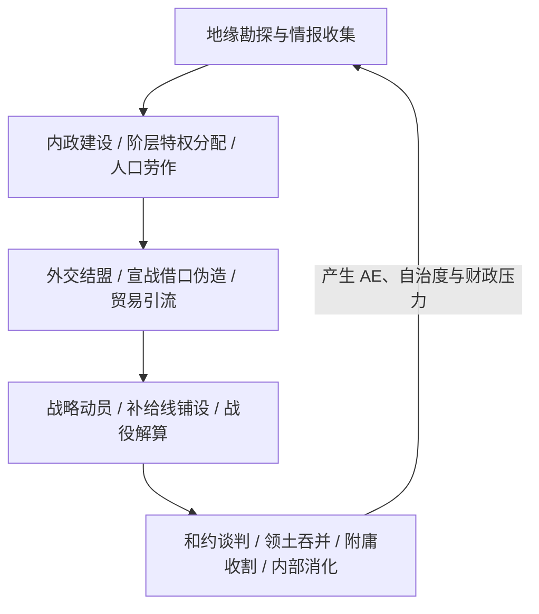

# 策略游戏标准策划案模板 (Strategy Game Design Document Template)
**项目代号（Project Codename）**：`Project_Chronos`  
**游戏类型（Genre）**：大战略（Grand Strategy） / 历史 4X / 战术模拟  
**目标平台（Target Platform）**：PC (Steam / Web / Custom Engine)  
**文档版本（Version）**：v1.0.0  

---

## 一、游戏核心愿景与高层概念 (High-Level Concept)

### 1.1 一句话介绍 (Elevator Pitch)
> *用一句话概括：玩家扮演什么角色，处于什么历史/架空背景，通过什么核心行为，克服什么挑战，最终达成什么目标。*

### 1.2 核心设计支柱 (Core Design Pillars)
1. **支柱 1：[如：极度严谨的后勤与地理决定论]** - 一切扩张受制于补给线与地形险阻。
2. **支柱 2：[如：多维阶层政治与内部博弈]** - 外部征伐的前提是安抚内部贵族与市民利益。
3. **支柱 3：[如：非绝对理性的动态 AI 地缘网络]** - AI 根据人格偏好与威胁评估做出类人博弈。

---

## 二、核心游戏循环 (Core Game Loop)

---

## 三、底层时钟与宏观地图系统 (Time & Map Architecture)

### 3.1 时序系统 (Tick / Turn System)
- **机制类型**：[可暂停的即时日历制 (Real-time with Pause, 类似 EU4) / 离散回合制 (Turn-based, 类似 Civ)]
- **时间步长 (Delta Time)**：每日结算 (Daily Tick)、每月结算 (Monthly Pulse)、每年结算 (Annual Epoch)。

### 3.2 地图与省份拓扑 (Provincial Topology)
- **节点与连边 (Graph Representation)**：省份邻接图、海域航线图、关隘阻断机制。
- **地形类型与修正**：平原（宽战面）、山地（防御+2、战斗宽度-50%）、河流（渡河惩罚）。

---

## 四、核心系统设计 (Subsystems Specification)

### 4.1 军事与战役解算系统 (Combat & Warfare System)
- **兵种克制与配比**：前排肉搏/盾步、两翼重骑兵/骑射、后排远程/炮兵。
- **伤害解算数学公式**：
  $$\text{Damage} = \text{Base} \times \left(1 + \frac{\text{Attack} - \text{Defense}}{10}\right) \times \text{RollModifier}$$
- **围城与阻击机制**：要塞等级、补给封锁、马尔可夫状态转移。

### 4.2 经济、贸易与人口系统 (Economy & Trade Architecture)
- **人口模型 (Pop System)**：劳动力、士兵、贵族、学者；人口增长与饥荒损耗。
- **贸易流向与价值网络**：有向无环图（DAG）流通、贸易力量竞争、引流 Steering 乘数。

### 4.3 外交、宗主附庸与地缘包围网 (Diplomacy & Geopolitics)
- **侵略扩张度（AE）与反国家同盟**：侵略行为累积威胁值，触发多国围攻。
- **宗主与附庸网络**：封建采邑、朝贡国、同君联合（PU）、贸易保护国。

### 4.4 内部政治与阶层利益集团 (Internal Estates & Politics)
- **权力平衡**：贵族、教士、军头、商人阶层的忠诚度与影响力分配。
- **特权授予与收回代价**：用短期特权换取即时点数/现金，但牺牲长期王权控制力。

---

## 五、AI 决策架构 (AI Decision Architecture)
- **有限状态机 (FSM) 与行为树 (Behavior Tree)**：和平发育态、战备动员态、领土扩张态、求和自保态。
- **效用评估函数 (Utility Function)**：
  $$\text{WarDesire} = w_1 \cdot \text{MilitaryStrengthRatio} + w_2 \cdot \text{StrategicClaimValue} - w_3 \cdot \text{AEThreat}$$

---

## 六、数值平衡与原型验证计划 (Prototyping & Balancing)
- 阶段 1：在沙盘计算器中验证核心战斗公式的单调性与胜率方差。
- 阶段 2：模拟 100 轮 AI 自运行观察地缘洗牌与大国崩盘几率。
