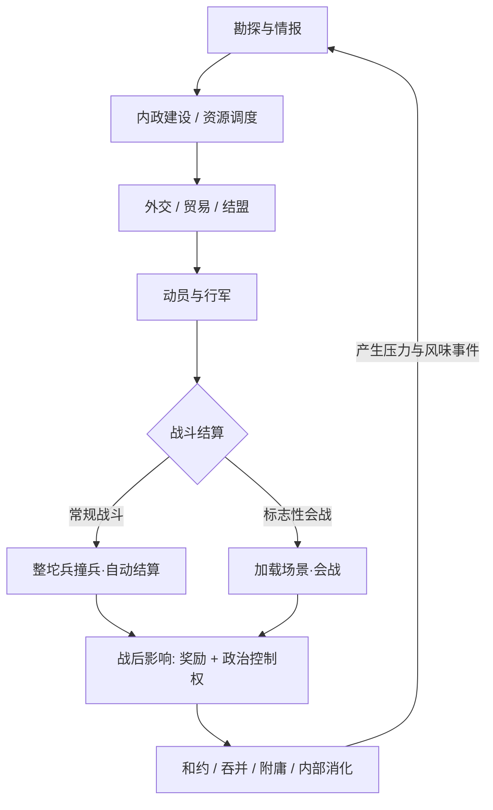

# 《Project Chronos》第一期游戏策划案（GDD v0.1）

> **上游输入**：[《Project Chronos》玩法框架与玩家调研分析](../docs/chronos_research_analysis.md)（v1.0.1）——玩法框架 + 8 大调研根因（R1–R8）+ 决策矩阵（D1–D8）。
> **本文状态**：✅ 确定项落地为具体设计 / ⚠️ 待验证项显式标注（沿用调研文档的 ✅/⚠️/📎 标注体系）/ 📎 参照系仅作选型参考。
> **遵循模板**：[策略游戏标准策划案模板](GDD_TEMPLATE.md)；未决与占位内容按[文档整理规范](../docs/DOCUMENTATION_STANDARD.md)使用 `⚠️` / `<!-- TODO -->` / `<!-- STUB -->` 标记。

---

## 〇、决策落点速览（矩阵 → 章节映射）

| 决策项 | 调研结论 | 落位章节 | 落地状态 |
| :--- | :--- | :--- | :--- |
| **D1** 题材 | 国内题材 + 梗文化位为主探索方向；冷兵器优先 | §1.3 | ⚠️ 待市场验证（调研结论落地，未验） |
| **D2** 将领特化 | 特殊化 + 时代调节权重 + 稀缺化；RPG 上限参照杭的判据 | §4.1.3 | ✅ 方向确定（数值 ⚠️） |
| **D3** 地图系统 | 六角格为主；战斗层预留无格/欧根式空间；点对点划线远期扩展 | §3.2 | ✅ 倾向确定 |
| **D4** 战斗形态 | 双轨：撞兵/自动结算底座 + 标志性会战加载场景；自动战斗兜底 | §4.1.1 | ⚠️ 核心未决（工程量） |
| **D5** 城地表达 | 城 = 特殊格子（2–7 格大六边形），建筑影响作战地形 | §3.2.3 | ✅ 确定 |
| **D6** 回合节奏 | 分代 + 自动执行：古战 3 个月 / 火枪后 ≤1 个月 / 战术级 ≤1 周 | §3.1 | ✅ 方向确定（数值 ⚠️） |
| **D7** 竞品定位 | 自由度 = 地块数 × 可操作深度；避坑清单；MOD 生态位 | §1.4 / §4.7 | ✅ 避坑清单 |
| **D8** 吸引力支柱 | 稳定系统 / 风味沉浸 / 控制力自由度；AI 平衡 + 性价比为隐性支柱 | §1.2 / §5 | ✅ 确定 |

---

## 一、游戏核心愿景与高层概念 (High-Level Concept)

### 1.1 一句话介绍 (Elevator Pitch)

> 玩家扮演一个历史政权或势力（**国内题材为主探索方向、冷兵器优先**），在六角格"城=地"的宏观地图上按时代分代回合推进（古战 3 个月 / 火枪后 ≤1 个月），以"整坨兵撞兵 + 自动结算"支撑长期高频战争，关键战役进入加载场景的标志性会战；将领随时代调整特化权重，系统稳定可信、风味沉浸可玩梗，**自由度与 MOD 开放性是第一天就写进架构的硬指标**。

### 1.2 核心设计支柱

三大支柱（R8：9 段调研的共振共识）+ 两条隐性支柱：

1. **支柱 1：稳定可运行的系统（机制先行，考据支撑）** — R1/R8。
   - 森：*"有一套在游戏设定世界观内相对稳定、普遍、可运行的系统"*；学生：*"通过足够细致的数据和可操作性……假装自己能模拟历史"*。
   - 决策规则：任何机制先问"是否稳定可推演"，再问"是否考据正确"；历史要素"捕风捉影"式点到为止，忌过度设计喧宾夺主。
2. **支柱 2：风味与沉浸（含玩梗价值）** — R8。
   - 随机事件、养成路线、背景故事、美术表现是**设计支柱而非附属品**；反面教材 SGS taiping（做了风味但没做好）。
   - 硬规则：风味层有独立验收标准，不达标 = 负资产（§4.6）。
3. **支柱 3：控制力与自由度** — R7/R8。
   - 晋：*"最大吸引力，其实是控制力"*；秦：*"地块多少决定自由度。自由度决定玩家发挥程度，和游戏上限程度"*。
   - 硬指标：**自由度 = 地块数 × 可操作深度**（D7）。
4. **隐性支柱 A：AI 平衡** — 唐史：*"人和 AI 相对平衡，可以在游戏内看到玩家对局面扰动的蝴蝶效应"*。AI 按支柱级资源投入（第五章），不是收尾功能。
5. **隐性支柱 B：性价比** — 森：*"游戏周期较长，游戏实际性价比较高"*。单局时长可长可短，防"伪复杂"（见 §1.4 避坑 1）。

### 1.3 题材与舞台设定

**题材（D1 ⚠️ 待市场验证）** —— 调研结论见[玩法框架与玩家调研分析](../docs/chronos_research_analysis.md)决策矩阵 D1

- 主探索方向：**国内题材 + 梗文化位**（D1 调研建议：森的产品判断优先——深度玩家更吃"国内 + 梗文化"）。
- 时间取向：**冷兵器优先**（D1 调研建议：晋"热兵器国内题材有点微妙危险"提示 + 石要热兵器的 1/9）。
- 出戏风险治理：考据**外包给专业审核**（D1 调研建议，治"国内考证出戏"；R1）。
- 📎 素材库入口：[历史制度原型典籍](../04_historical_archetypes/archetypes_catalog.md)（封建、军功爵、重商主义、朝贡体系等已拆解条目）。

<!-- TODO: 题材市场验证（V1）—— 二手市场数据检索（销量 / MOD 下载量 / 社区二创热度）或原型阶段市场测试 -->

**舞台尺度（⚠️ 开放问题 2）**

- 未定：宏观独走，还是三尺度贯通（宏观调度 → 中观行军 → 微观会战）。
- 建议：**先按"贯通"出原型再砍**——三尺度贯通能同时验证 D4 双轨与 D6 分代，砍掉比返工便宜。

### 1.4 竞品定位与避坑清单（D7 ✅）

- 生态位：**自由度 = 地块数 × 可操作深度**。P 社的护城河是 MOD 生态 + 地块自由度，而非"历史模拟"本身（杭/秦，R7）。
- **避坑清单**（对应竞品病根，全部进入设计评审 checklist）：
  1. **伪复杂**——"看着多做用少"（超级力量 / EU5 病）；
  2. **时空观出戏**——步兵骑兵同速、越古越强（文明病）；
  3. **内政外交简陋**——战斗出色但经济/外交是摆设（全战病，附庸莫名宣战）；
  4. **无 MOD 生态位**——数据结构封闭（§4.7 反向条款）。

---

## 二、核心游戏循环 (Core Game Loop)

### 2.1 宏观主循环（战略层）



- 回合结束自动执行（D6）：玩家"一顿计算直接到下一个月"（杭）或设定意图后长程自动推进（唐史/森）。

### 2.2 会战入口（战役 → 战术层，⚠️ 门槛数值待定）

- **触发条件**（草案）：决定性力量对比 / 关键战略要地（城、关隘）/ 玩家主动宣战目标。
- **四节流程**（沿用调研 1.5 式③通用骨架）：地图/关卡（可特化：攻城、水战）→ 布阵 → 行动 → 结算。
- **默认兜底**：任何会战都提供"自动结算"选项（森：*"设计自动战斗的功能"*），防止下棋疲劳（唐史：*"战斗场景下棋在后期可能会累死人"*）。

---

## 三、底层时钟与宏观地图系统 (Time & Map Architecture)

### 3.1 时序系统（D6 ✅ 方向确定，数值 ⚠️）

- **分代回合节奏**（秦的提案作基准，原型沙盘微调）：
  | 时代 | 战略级回合 | 战术级回合 |
  | :--- | :--- | :--- |
  | 火枪时期以前 | 3 个月 / 回合 | ≤1 周 |
  | 火枪时期以后 | ≤1 个月 / 回合 | ≤1 周 |
- **自动执行**：本回合操作完成后自动推进到下一月；支持长程意图设定（移动/造兵/宣战）后的自动执行。
- **设计原则**：回合粒度是"操作框架"的下游（R6 石：*"时间尺度跟着操作框架走"*），不是独立参数——先定每回合玩家做什么，再定时间跨度。
- 📎 参照：三国志 9（1 周/命令）、英雄无敌 3（1 天/回合，中观层参照）；赣：*"回合越大越桌游，回合越小越即时"*（警惕过大回合的桌游感）。

### 3.2 地图与省份拓扑（D3 ✅ 六角格 + D5 ✅ 城=地）

#### 3.2.1 网格选型

- **六角格为主**：森：*"如果要拿比较拟合现实时空的话，用六角格……真正意义上的距离均等"*；秦：*"方格和六角格本质代表一个地区在游戏单位时间内可以通行和进入的容量"*（容量论 → §3.3）。
- 方格降级备选（唐史：*"方格更方便，地区划分对划分者要求过高"*）——保留为制作成本兜底。

#### 3.2.2 城 = 特殊格子（D5 ✅）

- 城市占据 **2–7 格的大六边形区块**（晋提案：*"把城市设计成更大一圈的六边形，尤其是涉及复杂地形"*）；
- 城上/周边**建筑影响作战地形**（森：*"一个城占一块地，城上面/周边的建筑影响作战时的地形"*）；
- 城市是"特殊格子"而非点（学生），切断点式城市的地理断裂感；
- 中尺度备选：三国志式"城 + 辖地区块"（秦）——保留，供大地图细化时切换；现代题材可放大城市体量（晋）。

#### 3.2.3 网格自由度预留

- 战斗层预留**无格 / 欧根式**空间（晋：*"欧根那种战役走格子，战斗没格子的"*）；
- 点对点自由划线（秦"自由花线"，原文档笔误已注明）作远期扩展。

#### 3.2.4 地形修正草案（数值待沙盘验证）

| 地形 | 拟用修正 |
| :--- | :--- |
| 平原 | 宽战面 |
| 山地 | 防御 +2、战斗宽度 −50% |
| 河流 | 渡河惩罚 |

### 3.3 移动与容量（秦容量论落地）

- 移动力 = 单位在"每回合单位时间"内可穿越的**格子容量**（不是单纯的距离计数）。
- 设计含义：大军团受地形容量限制（宽战面/瓶颈），从机制上防"堆兵一格"的伪战略，呼应"地理摩擦"论点。

---

## 四、核心系统设计 (Subsystems Specification)

### 4.1 军事与战斗解算系统（D4 ⚠️ / D2 ✅）

#### 4.1.1 战斗双轨（⚠️ 核心未决，工程量需评估）

| 轨道 | 形态 | 适用场景 | 参照 | 成本 |
| :--- | :--- | :--- | :--- | :--- |
| **底座（默认）** | 整坨兵统一结算：单数值（X 攻 Y 血）或可拆分（前排/后排） | 长期高频战争（森 20 年判据） | 📎 教改风云（一坨兵 = X 骰子掷 Y 个）、P 社式（30 兵 20 参战） | 低 |
| **高光（可选）** | 标志性会战进"加载场景"，明确玩法设计 | 决定性战役、关键城塞 | 📎 终极将军：内战（秦推荐）、Axis & Allies 大战略图 + RTS 小图 + 建筑建造（杭推荐） | 高 |

- **调和判据（森）**：时间跨度 ≥20 年且战斗频繁 → 撞兵；跨度短 → 下棋式。**自动战斗功能必须存在**。
- ⚠️ 待验证：会战场景引入多少（每局 1 个标志性会战 vs 多场）——MVP 阶段建议只做 **1 个"会战原型"** 验证仪式感价值（P3）。

#### 4.1.2 战术结算公式（占位）

<!-- TODO: 战斗公式定稿 — 接入 03_prototypes_and_tools 工作台验证（已有伤害/士气双轨衰减原型可复用） -->

- 模板基准：$\text{Damage} = \text{Base} \times \left(1 + \frac{\text{Attack} - \text{Defense}}{10}\right) \times \text{RollModifier}$
- **透明度要求**（赣）：*"不管是欧陆还是文明经常掩去具体计算公式，让我不爽"* → 数值面板必须向玩家展示完整计算过程。

#### 4.1.3 将领特化（D2 ✅ 方向确定，数值 ⚠️）

- **时代调节权重**（森分界论）：以拿破仑战争为分界，之前将领权重高（汉尼拔式逆天改命），之后权重衰减（德军名将 = 骰子 +1 级）。
- **稀缺化**：强大将领更"珍惜"（唐史）——获得难、可损失、数量与质量平衡（秦）。
- **RPG 上限**：有特色但不过头（杭判据：*"将领还是需要有一些自身特色，但是全战三国那种属于过头了"*）。
- **模式开关**：推演/严肃模式提供"将领淡化"开关（学生）；PC 版将领数据结构从第一天支持 MOD 自定义（北大，§4.7 联动）。

#### 4.1.4 战后影响（✅ 确定，双通道）

1. **战斗/关卡奖励**：缴获（钢铁雄心）/ 劫掠（全面战争）/ 俘虏（统一指挥）/ 额外奖励（机战系列）；
2. **大地图政治控制权**：战斗输赢影响区域控制权（信长之野望"大威风"、汉尼拔：罗马 VS 迦太基）。

### 4.2 资源体系（✅ 三分法成立，数值 ⚠️）

```
物质资源（钱/能源/魔法等货币）
   ├── 兑换 ──→ 战斗资源（单位 / 特殊角色 / 战斗缴获）
   └── 转化 ──→ 其他资源（科技 / 卡牌 / 天气 / 外交政治状态）
```

| 资源类型 | 内容明细 | 参照 |
| :--- | :--- | :--- |
| **物质资源** | "钱"、能源、魔法等货币；可借鉴"一种钱买所有东西"的 simplicity（strategic command 系列），或分币种（钱 + 人力，EU4） | 📎 钢 4 / 欧陆 4 / strategic command |
| **战斗资源** | 战斗单位；特殊角色（属性/物品/技能/槽位/人物关系——从属、羁绊）；战斗获得资源（§4.1.4） | 📎 英杰传 / 机战 / 终极将军 |
| **其他资源** | 天气、环境、科技、卡牌、特性、外交政治状态；卡牌可单独作核心资源 | 📎 光荣之路 / 教改风云 / 汉尼拔 |

- ⚠️ **兑换比例曲线**需进沙盘验证（开放问题 4，复用[自研机制原型工作台](../03_prototypes_and_tools/index.html)）。

### 4.3 经济、贸易与人口系统

<!-- STUB: 结构占位，内容未写 — 本次调研未覆盖，待 GDD v0.2。模板参考：人口模型（劳动力/士兵/贵族/学者）、贸易 DAG 流向与引流乘数、饥荒损耗 -->

### 4.4 外交、宗主附庸与地缘网络

<!-- STUB: 结构占位，内容未写 — 调研仅确认"外交政治状态"属其他资源与风味层，具体机制待 v0.2。模板参考：AE 与反国家同盟、附庸网络（封建采邑/朝贡/PU）、地缘包围网 -->

### 4.5 内部政治与阶层利益集团

<!-- STUB: 结构占位，内容未写 — 历史制度素材见 archetypes_catalog.md（军功爵、重商主义、封建采邑），机制化待 v0.2。模板参考：权力平衡、特权授予与收回代价 -->

### 4.6 风味层（✅ 设计支柱）

- **内容**：随机事件、养成路线、背景故事、美术表现。
- **原则（R1）**：机制先行、考据支撑；历史要素"捕风捉影"式点到为止，忌过度设计喧宾夺主。
- **反面教材**：SGS taiping——做了风味但没做好 → 风味层有**独立验收标准**（不达标 = 负资产）。
- **玩梗价值（R8 森）**：风味叙事要能产生"玩梗的快乐"——国内题材 + 梗文化位的核心落点。

### 4.7 MOD 生态位（D7 ✅）

- 原则：P 社的护城河是 MOD 生态（杭：*"P 社做不到的玩家替它做"*）——数据结构开放性**从第一天写进架构**。
- v0.1 声明、v0.2 细化的接口清单：
  1. 单位/将领/事件/文化数据全部**数据驱动**（JSON/DSL，非硬编码）；
  2. 提供 modding 文档与样例（TODO）；
  3. 事件脚本支持"条件 + 效果"的可组合语法（参考 EU4/CK3 事件系统）。

<!-- TODO: modding 文档与样例工程 -->

---

## 五、AI 决策架构 (AI Decision Architecture)

### 5.1 设计目标（R8 隐性支柱 A）

- **AI 平衡**：人和 AI 相对平衡，玩家能观察到对局面的"蝴蝶效应"扰动（唐史）。
- **系统可信**：AI 行为必须可解释、符合历史直觉——"假装严谨"的关键（学生）。
- 决策规则：**AI 是支柱级资源**，不是收尾功能。

### 5.2 状态机草案（沿用模板）

- 和平发育态 → 战备动员态 → 领土扩张态 → 求和自保态（+ 附庸操控态，v0.2 补充）。

### 5.3 效用函数草案

<!-- TODO: WarDesire 效用公式参数化 — 接入原型工作台验证 -->

- 模板基准：$\text{WarDesire} = w_1 \cdot \text{MilitaryStrengthRatio} + w_2 \cdot \text{StrategicClaimValue} - w_3 \cdot \text{AEThreat}$
- 要求：权重参数可从 **mod 侧覆盖**（与 §4.7 MOD 生态位联动）。

---

## 六、数值平衡与原型验证计划 (Prototyping & Balancing)

| # | 验证项 | 关联决策 | 方法 | 前置材料 |
| :-- | :--- | :--- | :--- | :--- |
| P1 | 资源兑换比例曲线 | D2 | 沙盘调参（03 工作台） | 资源清单 v0.2 |
| P2 | 20 年判据 → 撞兵/下棋分界 | D4 | 长期高频 vs 短期低频对照模拟 | 回合节奏参数（§3.1） |
| P3 | 标志性会战仪式感价值 | D4 / 舞台尺度 | 单会战原型 + 小规模试玩 | 1 个会战场景 |
| P4 | 分代回合数值微调 | D6 | 三时代对照沙盘 | 秦基准值（§3.1） |
| P5 | 战斗公式透明度 | R4 赣 | 数值面板 UI 原型 | 公式定稿（§4.1.2） |

### MVP 取舍建议

1. **底座先行**：整坨兵撞兵 + 自动结算 + 分代回合 + 六角格/城=地（全部 ✅ 项），独立成可玩的"战略涂色"层；
2. **会战验证**：只做 1 个加载场景会战原型（仪式感假设验证，P3）；
3. **风味层暂缓**：题材（D1 ⚠️）市场验证定案后再启动风味层与大规模美术投入。

---

## 七、待验证清单（全部 ⚠️ 汇总）

| # | 待验证项 | 来源 | 验证方式 | 阻塞项 |
| :-- | :--- | :--- | :--- | :--- |
| V1 | 题材：国内+梗 vs 国外考据 | D1 | 二手市场数据（销量/MOD 下载量/社区二创热度）或原型期市场测试 | 无 |
| V2 | 主舞台尺度：宏观独走 vs 三尺度贯通 | 调研开放问题 2 | 贯通原型再砍 | 依赖 V3 的会战原型 |
| V3 | 战斗双轨工程量与会战数量 | D4 / 调研开放问题 3 | 会战原型（P3） | 依赖 P2 |
| V4 | 资源兑换比例数值 | D2 / 调研开放问题 4 | 沙盘（P1） | 资源清单 v0.2 |
| V5 | 回合分代基准微调 | D6 | 沙盘（P4） | 无 |
| V6 | MOD 接口设计 | 调研开放问题 5 | 数据结构评审 | 与 §4.3–4.5 同节奏 |

---

## 相关文档

- [《Project Chronos》玩法框架与玩家调研分析](../docs/chronos_research_analysis.md) —— 本文全部决策的输入（✅/⚠️/📎 标注体系同源，含受访者原文证据）
- [策略游戏标准策划案模板](GDD_TEMPLATE.md) —— 本文遵循的模板结构
- [模块化机制设计指南](../02_mechanics_architecture/modular_systems_guide.md) —— 时钟/经济/战斗/AI 的实现层指南
- [历史制度原型典籍](../04_historical_archetypes/archetypes_catalog.md) —— D1 题材与 R1 考据的历史素材库
- [自研机制原型工作台](../03_prototypes_and_tools/index.html) —— P1/P2/P4 的验证工具
- [文档整理规范](../docs/DOCUMENTATION_STANDARD.md)
